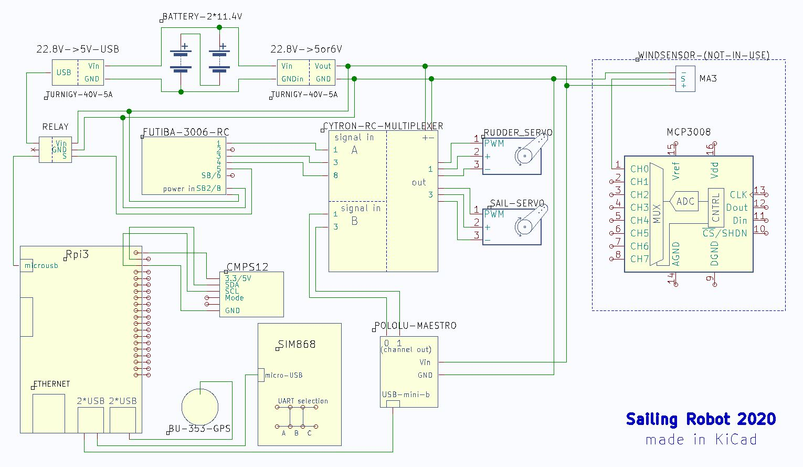

# SailingBoat
Project application for the "Programkonstruktion och projekthantering"
(also known as the PoP kurs) course at Åland Polytechnic.

## Components
More info [this link](doc/hardware/components.pdf)
- PC - Raspberry Pi 3 WiFi
- Boat - RC Laser
- Receiver - Futaba
- Controller - Futaba
- Switch - RC Switch
- Servo Controller - Maestro
- Servo - Futuba
- Relay - Omron
- GPS - GlobalSat
- Compass - CMPS12
- Converter - Turnigy 40V 5A
- Batteries - Turnigy 11V 500mAh

## Diagram
Hardware scheme [this link](doc/hardware/scheme_hardware.JPG)




## Code Procedure

1. Determine destination (Latitude, Longitude)
2. Check wind to determine best angle of approach (AOA)
3. Select angle and set a waypoint (in meters)
4. Each update cycle, compare our current bearing vector and adjust the
   waypoint, adjust bearing as neccesary.
5. repeat step 2-4.

# Getting Started
This guide will configure your Raspbian installation, install the much
needed scripts and finally building the project and starting it up.

## Prerequisites
Make sure you have installed Raspbian on your Raspberry Pi and gone
through the *raspi-config* application provided by Raspbian.

## Step 1: Install required packages
Just use this command to install most required packages.

```bash
sudo apt install i2c-tools gpsd libgps-dev libboost-all-dev curl
```
The last package needed is WiringPi, you can clone the WiringPi
repository and build that from source.

Start by cloning the repository:
```
git clone https://github.com/WiringPi/WiringPi
```
Go into the directory and write:
```
./build
```
and that will build the library and you will finally be able to use
WiringPi as a library when compiling.

## Step 2: enable RPi Interfacing Options
There are several services which is required to be enabled in order
for the RPi to function with the code, as well as with the hardware,
and those services are:

```
- SPI
- I2C
- Serial
- SSH
```
All of these can be enabled through *raspi-config* under **Interfacing Options**

## Step 3: Install services & Misc

Inside the **scripts/** directory, you will find *install-services.sh*
run this file as sudo.

In order to have everything set-up for the application, you will also
need to run *install-config-and-logs.sh* for certain log and settings
folders and files to be added into *.config/*

## Step 4: Build and run

Before any sort of build, you should always make sure that the
repository you have cloned is up-to-date, so start by doing **git
pull** so the latest version is pulled from github.

Following that, you should build it:

```
make -j$(nproc)
sudo make install
```

this will build the application and install it to **/usr/local/bin**
so now all that's needed is to run the application as sudo like this:

```
sudo sailingBoat
```

## Optional add-on
[Front-end](https://github.com/Dreameh/sailboat-logsite) can
be used as a front-end for logs and adding coordinates to the
application if you use a HTTP server that can handle the requests and
the current one used is [this](https://github.com/Dreameh/python-simple-http).

## License
This application is licensed under [MIT](LICENSE).
